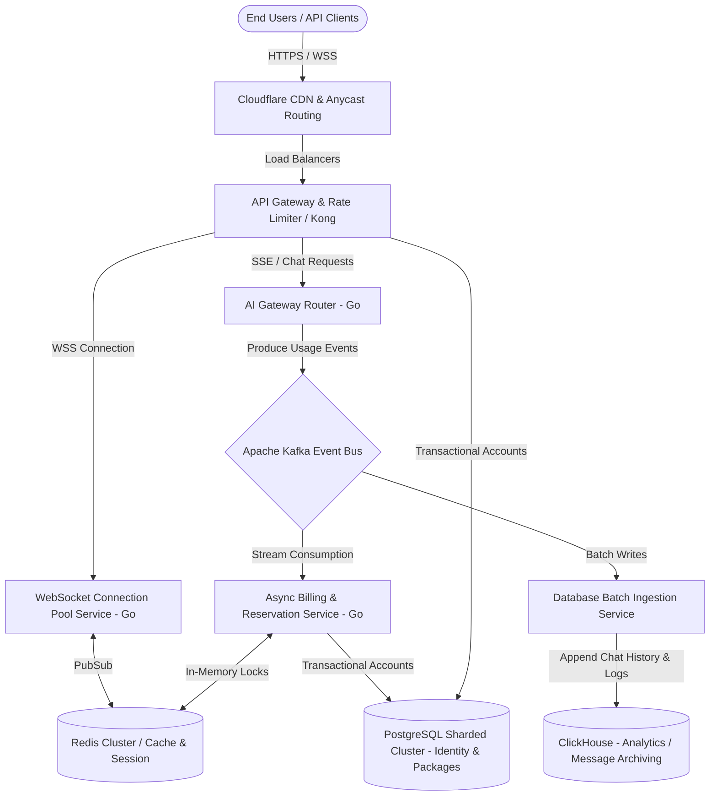

# Scaling Architecture for 1 Million Concurrent Users

Serving **1 million concurrent users** on an AI aggregation platform requires shifting from a standard web application architecture to a **high-throughput, distributed, event-driven microservices system**. 

At this scale, the primary bottlenecks are not CPU processing, but rather **network I/O (handling persistent WebSocket streams), write-heavy database transactions, and network socket exhaustion**.

---

## 1. Bottlenecks in the Current Architecture (Laravel/Postgres/Reverb)

If deployed under the current specifications (Laravel 12 + Postgres + Laravel Reverb), the system would experience catastrophic failure at a fraction of the 1M user target:

### A. PHP Process & I/O Model
* **The Problem:** Laravel is traditionally synchronous. While tools like Octane (Swoole/RoadRunner) improve performance, standard PHP execution blocks a worker process for every outbound connection. 
* **At Scale:** If 10% of your 1M users (100,000 users) are receiving a streaming AI response at the same instant, you have 100,000 active, long-lived HTTP requests open to OpenAI/Anthropic. PHP-FPM would require 100,000 concurrent processes, exhausting server memory and crashing the system instantly.

### B. Laravel Reverb for WebSockets
* **The Problem:** Reverb is written in PHP. While highly optimized for Laravel apps, it cannot handle millions of persistent WebSocket connections efficiently.
* **At Scale:** A single Go or Rust server can handle 100,000+ open WebSocket connections using minimal memory via non-blocking epoll event loops. Doing the same in PHP requires massive server clusters and introduces significant memory overhead.

### C. Database Write Bottleneck (PostgreSQL TPS)
* **The Problem:** Relational databases like PostgreSQL are optimized for ACID compliance but struggle with high-frequency write transactions.
* **At Scale:** 100k active requests mean 100k writes to `chat_messages`, 100k writes to `usage_logs`, and 100k balance updates *per second*. Postgres cannot handle 100,000+ writes per second on a single primary database due to disk I/O lock contention on index updates and Write-Ahead Logs (WAL).

### D. Single-point Wallet Lock Contention
* **The Problem:** Under the current schema, checking and deducting wallet balances relies on locking rows (`SELECT FOR UPDATE`).
* **At Scale:** In Phase 3, team members share an organization wallet. If a company has 500 developers using the API simultaneously, they will all contend for the *same* wallet row lock in Postgres. This causes transactional blockages, latency spikes, and timeouts.

---

## 2. The High-Scale Target Architecture (1M Concurrent Users)

To achieve this level of concurrency, we must separate the high-throughput, real-time path (Chat & Billing) from the transactional administration path.

### Key Architectural Shifts:

### 1. High-Performance Runtime for Connection Tier (Go/Rust)
* **WebSocket Service:** Build the WebSocket connection pool as a stateless microservice written in **Go (utilizing `gnet` or Gorilla WebSockets)** or **Rust (Tokio)**. This service's sole job is to hold 1M connections open, listening to a Redis Pub/Sub cluster to stream messages back to users.
* **AI Gateway Service:** Build this in Go. Go's native goroutines handle concurrent, blocking outbound HTTP client connections (SSE streams from OpenAI) with almost zero overhead (approx. 4KB memory per goroutine, compared to megabytes per PHP process).

### 2. In-Memory Wallet Reservations (Redis Lua)
To avoid database lock contention:
* Cache active user wallet balances in a distributed **Redis Cluster**.
* When a chat request starts, execute an atomic Redis **Lua script** to verify and deduct the balance:
  * If the balance is sufficient, the Lua script decrements the balance in Redis and marks the reservation.
  * The actual Postgres database transaction is **not** touched during the request.
  * If the request succeeds or fails, a message is pushed to a queue to reconcile the Postgres ledger asynchronously.
* This shifts the balance check latency from ~20ms (Postgres) to **< 1ms (Redis)**, completely avoiding SQL write locks.

### 3. Event-Driven Database Ingestion (Kafka / RabbitMQ)
* **The Buffer:** Never write chat messages or usage logs directly to PostgreSQL in the request-response cycle.
* **The Flow:** The AI Gateway streams the response, calculates the cost, and pushes a `UsageCapturedEvent` to **Apache Kafka**.
* **The Ingestion:** An ingestion worker consumes messages from Kafka in batches (e.g., 5,000 messages at a time) and performs bulk inserts into the database. This reduces write IOPS by orders of magnitude.

### 4. Storage Decoupling (PostgreSQL + ClickHouse)
* **PostgreSQL (Transactional Data):** Keep PostgreSQL for identity, package status, configurations, and core wallet balances. Scale this tier using master-slave replication and horizontal sharding.
* **ClickHouse / Cassandra (Event Log Storage):** Move `chat_messages`, `usage_logs`, and `wallet_ledger_entries` (which are write-once, read-many) to a column-oriented DBMS like **ClickHouse** or a wide-column store like **Cassandra**. ClickHouse is designed to swallow millions of logs per second and run analytical margin queries in milliseconds.

---

## 3. Recommended Phased Scaling Roadmap

Transitioning to this scale does not mean you should write Go microservices on day one. You should scale in phases:

| Phase | Target Concurrency | Tech Stack Changes |
| :--- | :--- | :--- |
| **Phase 1 (MVP)** | 1,000 - 10,000 | * Laravel 12 + Octane (Swoole/RoadRunner) * PostgreSQL (Single instance) * Redis (Single node queue/cache) * Laravel Reverb for WebSockets |
| **Phase 2 (Growth)** | 10,000 - 100,000 | * Extract **AI Gateway** to a Go microservice * Split WebSockets to Node.js/Go backend behind Nginx * Implement Redis Lua cache for wallet check/deductions * Add Postgres Read Replicas |
| **Phase 3 (Scale)** | 100,000 - 1,000,000+ | * Full Go connection tier (WebSockets + SSE) * Introduce **Apache Kafka** event stream * Migrate logs/chats to **ClickHouse** * Cluster Redis and Shard Postgres |
